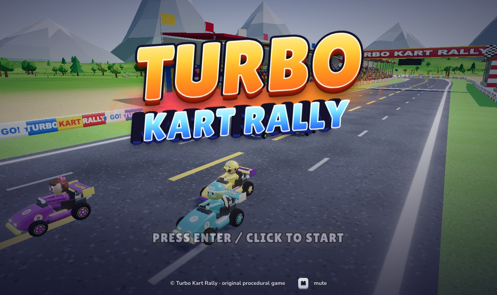
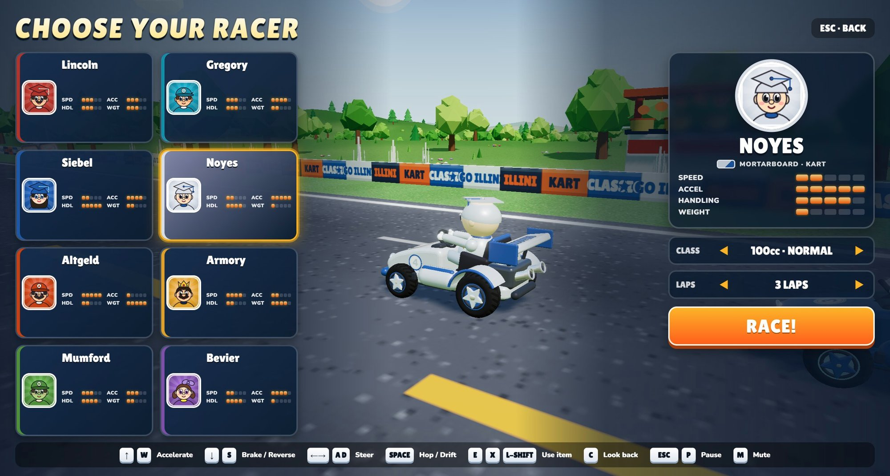
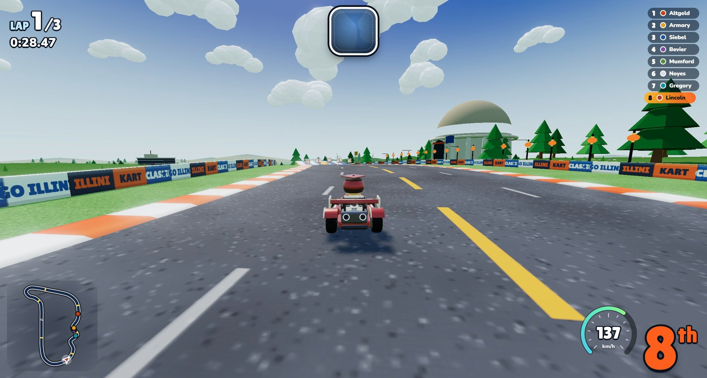
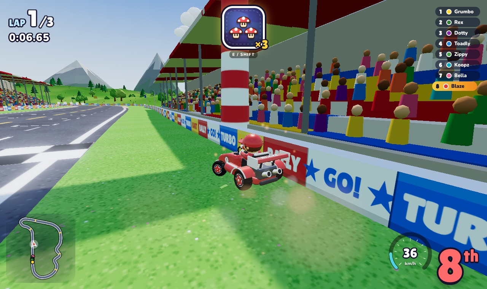
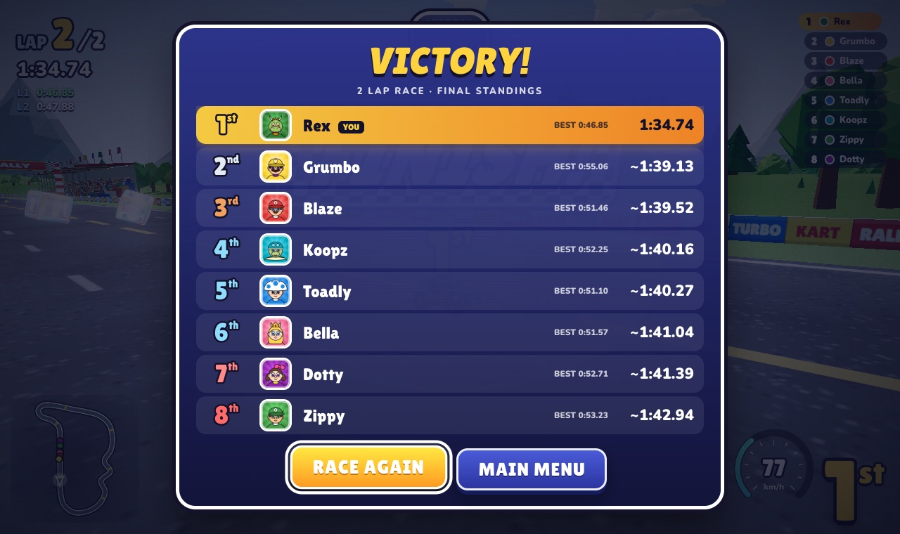

# Illini Kart Classic

**A UIUC-themed fork of [Turbo Kart Rally](https://github.com/bridge-mind/turbo-kart-rally)** — an arcade kart racer in the spirit of Mario Kart, built entirely with Three.js. Every mesh, texture, sound effect and music track is generated in code at load time. There are no asset files and no build step.

This fork keeps the upstream game and its circuit layout untouched, and re-themes everything around the University of Illinois: the palette is the official Illinois orange and blue, the eight drivers are named after campus buildings, and the track is lined with campus landmarks. See [What this fork changes](#what-this-fork-changes).

---

## What this fork changes

- **Palette.** Illinois blue `#13294B` and Illinois orange `#FF5F05` (plus `#1D58A7`, `#C84113`, `#C4E9F5`, `#FCB316`), taken from [brand.illinois.edu/web/web-color](https://brand.illinois.edu/web/web-color) and defined once in `src/config.js` (`THEME` / `THEME_CSS`). Sky, water, terrain, kerbs, barriers, grandstands, HUD and menus all read from it.
- **Roster.** The eight drivers are named after teaching buildings — Lincoln, Altgeld, Siebel, Noyes, Armory, Mumford, Gregory, Bevier — with a graduation-cap hat, and per-character stats unchanged.
- **Elevation.** The circuit is no longer flat: 33 m of range with a 15.8 % climb, a summit at +34, a **24 % plunge** off the bridge and a hairpin sitting in a real hollow. The landform is authored (`LANDFORMS` in `environment.js`) so the road cuts through a hill rather than riding an artificial mound. Three jump ramps and ten boost pads; karts leave the ground at the summit crest and on the big drop. The circuit's x/z layout is untouched — only the elevation column of the CP table changed.
- **Landmarks** (`src/landmarks/`, new). Memorial Stadium and State Farm Center flank the start/finish straight; the Illini Union, the Alma Mater statue, Altgeld Hall, Foellinger Auditorium, Siebel Center and the Morrow Plots corn rows sit around the lap; the McFarland Carillon replaced the lighthouse; the tropical mountains became an Illinois prairie horizon with grain silos, a town water tower and five turning wind turbines.
- **Campus props.** Corn rows replace the palms, the dropped banana hazard is now an ear of Illinois corn, the item box is an orange-and-blue crate carrying the campus "I", and the circuit banners read `ILLINI / KART / CLASSIC`.
- **Mid-autumn.** A full moon hangs over the prairie, strings of orange lanterns line the opening straight, and there is a mooncake stall in the infield.
- **Names.** The game is *Illini Kart Classic* on the *Illini Campus Circuit*.
- **Reverse course.** The select screen's `DIRECTION` (or `?reverse=1`) drives the same circuit the
  other way round. The control points stay authored in forward order; only the traversal order flips,
  and every authored accent — jump ramps, boost pads, item rows, the 14 landmarks — is mapped back onto
  the same patch of tarmac, so the campus does not move. Lap counting, the racing line, the banked
  corners, the grid and the barriers all come out mirrored for free.
- **Night.** The select screen's `COURSE` (or `?night=1`) swaps the whole track to a real night: deep
  navy sky with a star field, a big full moon placed along the same direction the key light comes from,
  moonlight shadows and fog, and **retro-reflective paint** — the kerbs, barrier panels, bridge rails,
  ramp stripes and the lane markings baked into the asphalt all glow, so the circuit still reads from
  the driver's seat at 2 a.m. The lantern strings, mooncake stall and full moon that were already there
  finally make sense.
- **Attract demo.** Leave any menu alone for 15 seconds and the cabinet plays for you: full screen, a
  fresh field of AI karts from the grid, the camera drifting between the leaders, and a
  `DEMO · <setup> — PRESS ANY KEY` pill at the bottom. Any key, click, wheel turn or gamepad press
  hands control straight back to the screen you were on. (The title screen has always run a live race
  behind the logo; this is that demo taking over the whole screen.)
- **The demo showcases every setup.** It starts on the one you are *not* looking at and then rotates
  every 32 seconds: day/forward → night/forward → night/reverse → day/reverse, rebuilding the circuit
  each time and naming the current setup in the hint. A cabinet left alone for a couple of minutes
  shows the whole matrix.

Track geometry, physics, AI, items and race rules are untouched: `dev/track-test.html` reports the same `centerline mismatches 0` / `racing line offroad 0` as upstream.

## Upstream README

The rest of this file is the upstream README, describing how the original game was built.

---

**An arcade kart racer in the spirit of Mario Kart, built entirely with Three.js. Every mesh, texture, sound effect and music track is generated in code at load time. There are no asset files and no build step.**

The whole game was produced by five Claude Opus 5.5 sub-agents working in parallel from a single prompt, without a single follow-up question. The prompt is reproduced below.

<p align="center">
  <a href="https://bridge-mind.github.io/turbo-kart-rally/"></a>
</p>

<p align="center">
  <a href="https://bridge-mind.github.io/turbo-kart-rally/"><strong>▶ Play it in your browser</strong></a>
</p>

## Play

**Just want to play?** Download [`dist/illini-kart-classic.html`](dist/illini-kart-classic.html) and
double-click it — that single file contains the game and three.js, so it needs no server and no
network. Otherwise open
**https://bridge-mind.github.io/turbo-kart-rally/** in a desktop browser with WebGL2 (Chrome, Edge,
Firefox or Safari). Click or press Enter on the title screen, choose one of eight racers, pick a
class (50cc, 100cc or 150cc), a lap count, a course (**day** or **night**) and a **direction**
(forward or reverse), then hit RACE!. A keyboard or a gamepad works.

Race seven AI drivers around the Illini Campus Circuit. Drift through corners and release for a mini-turbo. Grab item boxes and fire shells, drop corn, pop mushrooms, or call down lightning on the field.

## The prompt that built this

This is the complete, verbatim prompt given to Claude Code. Nothing else was specified.

> I need you to launch five opus 5.5 sub-agents and help me build a triple A quality game that is a clone of Mario Kart. What I want you to do is I want you to launch these sub-agents, build the game without asking me any questions at all, and use 3JS to build the game. And once you're done, report back to me.

## How it was built

The orchestrating agent wrote an architecture contract first ([ARCHITECTURE.md](ARCHITECTURE.md)), plus the shared config and event bus, then launched five sub-agents that each owned one slice of the codebase. No sub-agent edited another's files. Each one tested its slice in a real browser against stubs, and the game and UI agent then integrated and play-tested the whole thing.

| Agent | Owns | Delivers |
| --- | --- | --- |
| 1 · World | `track.js`, `environment/`, `track-textures.js` | Procedural circuit, barriers, boost pads, jump ramps, water, sky, scenery, grandstands, lighting |
| 2 · Driving | `kart.js`, `ai.js`, `input.js` | Arcade kart physics, drift and mini-turbo, AI drivers, keyboard and gamepad input |
| 3 · Items and FX | `items.js`, `effects.js` | Item boxes, roulette and eight items, pooled particle effects |
| 4 · Art and camera | `models.js`, `camera.js` | Karts, drivers, item models, portraits, chase camera |
| 5 · Game and UI | `main.js`, `race.js`, `hud.js`, `menu.js`, `audio.js`, `styles.css` | Game loop, race manager, HUD, menus, results, procedural audio and music |

`src/config.js` (roster, physics tuning, items, difficulty, key bindings) and `src/events.js` (the event bus) were written before the sub-agents started.

## Features

- **Eight racers**, each with their own hat, look and stats for speed, acceleration, handling and weight: Lincoln, Gregory, Siebel, Noyes, Altgeld, Armory, Mumford and Bevier.
- **Illini Campus Circuit**, about 2.1 km, with a long start straight, sweepers, an S-bend, a bridge over a lagoon, a hairpin, 8 boost pads, 2 jump ramps and 30 item boxes — lined with campus landmarks.
- **Arcade handling** with hop, drift, three-stage mini-turbo, a rocket start, trick boosts off ramps, off-road slowdown, wall bumps and kart-to-kart collisions resolved by weight.
- **Eight items**: mushroom, triple mushroom, corn (the dropped hazard), green shell, homing red shell, star, lightning and blue shell. Item odds are weighted by race position.
- **AI drivers** that follow a racing line, drift on corners, dodge hazards, use items tactically and rubber-band toward the player.
- **Fully synthesised audio**: engine, drift and item sounds, and a sequenced chiptune soundtrack with separate menu and race music that speeds up on the final lap.
- **Effects**: pooled drift sparks, boost flames, dust, star sparkles, explosions, confetti and speed lines, with bloom.
- **Presentation**: live demo race behind the title screen, intro flyover, 3-2-1-GO with start lights, position and lap HUD, item roulette, minimap, speedometer, final-lap and wrong-way banners, results screen.

## Controls

| Action | Keyboard | Gamepad |
| --- | --- | --- |
| Accelerate | W or Up | A or right trigger |
| Brake / reverse | S or Down | B or left trigger |
| Steer | A and D, or Left and Right | Left stick |
| Hop / drift | Space | RB or X |
| Use item | E, X or Left Shift | LB or Y |
| Look back | C | Click either stick |
| Pause | Esc or P | Start |
| Mute | M | |

Hold drift through a corner. Sparks turn blue, then orange, then purple. Release for a bigger boost the longer you held it. Hold accelerate as the countdown reaches GO for a rocket start.

## Run it locally

There is no build step. Serve the folder with any static server:

```bash
git clone https://github.com/bridge-mind/turbo-kart-rally.git
cd turbo-kart-rally
python3 -m http.server 8080
```

Then open http://localhost:8080. Three.js r170 is loaded from jsDelivr through an import map, so an internet connection is needed.

## Checks

```bash
npm install
npm run verify        # headless Chromium against dev/track-test.html and the single-file build
npm run build:dist    # regenerate dist/illini-kart-classic.html (needs bun)
```

`verify` asserts the things that have actually broken this project: the centreline round-trips to
itself, the racing line stays on the road, the terrain mesh never rises above the tarmac, the
single-file build really does contain every module and no CDN reference, and a race runs. Locally it
uses whatever Chromium/Edge/Chrome it finds; CI installs its own. `.github/workflows/ci.yml` runs the
same checks and additionally fails if the committed `dist/` is stale.

## Project layout

```
turbo-kart-rally/
├── index.html            entry page and import map
├── ARCHITECTURE.md       contract the five sub-agents built against
├── src/
│   ├── main.js           renderer, post-processing, state machine, game loop
│   ├── config.js         roster, physics tuning, items, difficulty, key bindings
│   ├── events.js         shared event bus
│   ├── track.js          circuit, surfaces, walls, racing line
│   ├── environment/      the world, split by concern
│   │   ├── index.js      wiring + the createEnvironment API
│   │   ├── common.js     noise, RNG, vertex painting, UV stripping
│   │   ├── sky.js        sky dome, environment map, lights, fog
│   │   ├── terrain.js    landforms, corridor blend, heightAt, terrain mesh
│   │   ├── water.js      lagoon / sea surface
│   │   ├── stands.js     grandstands, instanced crowd, waving flags
│   │   ├── vegetation.js trees, pines, corn, bushes, rocks, flowers, tufts
│   │   └── scenery.js    prairie horizon, clouds, carillon, boats
│   ├── landmarks/        decorative campus skyline
│   │   ├── index.js      placement + the mid-autumn props
│   │   ├── toolkit.js    geometry shorthands, Field builder, lettering, locator
│   │   └── campus.js     one function per building
│   ├── kart.js           kart physics
│   ├── ai.js             AI drivers
│   ├── input.js          keyboard and gamepad
│   ├── items.js          item boxes, roulette, items
│   ├── effects.js        particles and bursts
│   ├── models.js         karts, drivers, item models, portraits
│   ├── camera.js         chase camera
│   ├── race.js           laps, positions, countdown, finish
│   ├── hud.js            in-race HUD and results
│   ├── menu.js           title, character select, pause
│   ├── audio.js          Web Audio sound and music
│   └── styles.css        UI styling
├── dev/                  per-module test harnesses the sub-agents used
└── docs/screenshots/     images used in this README
```

Open `window.__game` in the browser console for debug hooks such as `startRace()`, `toFinalLap()`, `finishPlayer()` and `debug.autopilot = true`.

## Screenshots

| | |
| --- | --- |
|  |  |
|  |  |

## Disclaimer

Illini Kart Classic is a fan-made homage to the kart-racing genre. It is not affiliated with, endorsed by, or associated with Nintendo, and it is not affiliated with, endorsed by, or associated with the University of Illinois. No official University of Illinois wordmark, logo or other trademark appears anywhere in this project: everything, including the block "I" on the item crates, is drawn procedurally in code. It is a private, non-commercial fan project.

Upstream Turbo Kart Rally is MIT-licensed © 2026 BridgeMind; this fork keeps that licence and adds the theme work on top.

## License

[MIT](LICENSE) © 2026 BridgeMind
